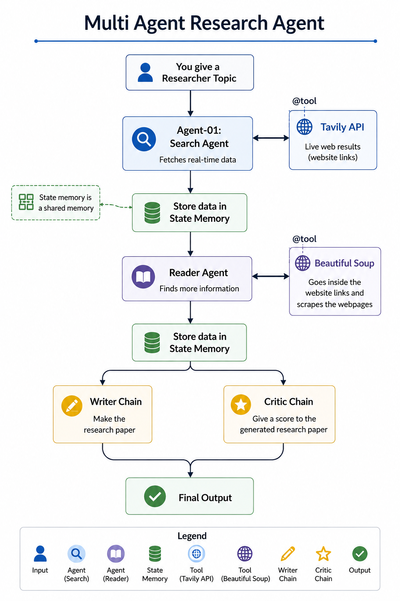
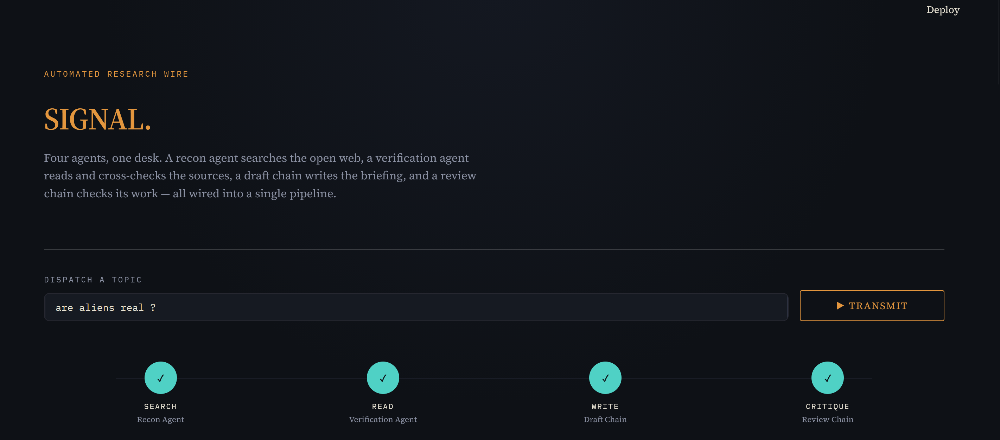

# Multi-Agent Research System

A multi-agent research system that takes a research topic and turns it into a structured, source-based report.

Instead of relying on one LLM to handle everything, the project breaks the research process into smaller tasks. Each agent has a specific job — finding sources, reading them, writing the report, and reviewing the final result.

## Flowchart



## Agents

### 🔎 Search Agent

The Search Agent is responsible for finding relevant and up-to-date information on the given topic.

It uses Tavily to search the web and collects useful details such as:

- Source titles
- URLs
- Search snippets

The agent focuses on finding good sources rather than trying to answer the entire research question itself.

### 📖 Reader Agent

Once the sources have been found, the Reader Agent goes a step deeper.

It looks through the search results, selects relevant URLs, and uses BeautifulSoup to scrape the webpages and extract their actual content.

The agent can work with multiple sources, giving the rest of the pipeline more information to work with instead of relying on a single webpage.

### ✍️ Writer Agent

The Writer Agent takes the research collected by the previous agents and turns it into a readable, structured report.

The report includes:

- Introduction
- Key Findings
- Conclusion
- Sources

The writer is also instructed to stick to the provided research and avoid making up information that isn't supported by the sources.

### 🧐 Critic Agent

Before considering the report finished, the Critic Agent reviews it.

It looks at things like:

- Whether the requested structure was followed
- How well the findings are explained
- Whether the report stays factual and objective
- Whether the sources are properly included

It then gives the report a score along with specific strengths, weaknesses, and suggestions for improvement.



## Tech Stack

- Python
- LangChain
- LangGraph
- Groq
- Qwen 27B
- GPT-OSS 120B
- Tavily
- BeautifulSoup
- Streamlit
- python-dotenv

## Models

Different models are used for different parts of the system:

| Component | Model |
|---|---|
| Search Agent | Qwen 27B |
| Reader Agent | Qwen 27B |
| Writer Agent | GPT-OSS 120B |
| Critic Agent | GPT-OSS 120B |

The Qwen model handles the search and source-reading tasks, where tool usage is the main focus. The larger GPT-OSS model is used for writing and reviewing the report, where stronger reasoning and generation quality are more important.

## Project Structure

```text
multi-agent-research-agent/
│
├── agents.py              # Search, Reader, Writer and Critic agents
├── tools.py               # Tavily search and BeautifulSoup scraping tools
├── pipeline.py            # Main research pipeline
├── app.py                 # Streamlit frontend
├── main.py                # Application entry point
│
├── flowchart.png          # Workflow diagram
├── requirements.txt       # Project dependencies
├── pyproject.toml         # Project configuration
├── README.md              # Project documentation
└── .gitignore             # Git ignored files
```

## Getting Started

### 1. Clone the repository

```bash
git clone https://github.com/Sauharda-py/Signal
cd multi-agent-research-agent
```

### 2. Create a virtual environment

```bash
python -m venv .venv
```

On Windows:

```powershell
.venv\Scripts\activate
```

### 3. Install the dependencies

```bash
pip install -r requirements.txt
```

### 4. Add your API keys

Create a `.env` file in the project root:

```env
GROQ_API_KEY=your_groq_api_key
TAVILY_API_KEY=your_tavily_api_key
```

Make sure `.env` is included in `.gitignore` so your API keys aren't accidentally pushed to GitHub.

## Running the Project

### Streamlit

The easiest way to use the system is through the Streamlit interface:

```bash
streamlit run app.py
```

Enter a research topic and the agents will take care of the rest.

### Command Line

The pipeline can also be run directly from the terminal:

```bash
python pipeline.py
```

You'll be prompted to enter a research topic.

## Example

For a topic such as:

```text
Impact of AI on semiconductor memory prices
```

the system searches for relevant sources, reads the useful webpages, combines the collected information into a research context, generates a report, and then reviews that report with the Critic Agent.

## Report Format

The Writer Agent produces a consistent report structure.

### Introduction

Sets the context for the topic and introduces the important concepts using the collected research.

### Key Findings

Explains the main findings from the researched sources with enough detail to make them useful.

### Conclusion

Brings the major findings together without adding unsupported information.

### Sources

Lists the URLs used during the research process.

## Why a Multi-Agent Approach?

The main idea behind the project is to give each part of the research process its own responsibility.

Finding information, reading sources, writing a report, and reviewing that report are different tasks. Separating them into individual agents makes the system easier to understand, debug, and improve.

It also means that a particular part of the system can be changed or upgraded without having to rebuild the entire pipeline.

## Future Improvements

Some things I'd like to explore further:

- Iterative Writer → Critic → Writer refinement
- Better source ranking and source diversity
- More reliable citation handling
- Support for JavaScript-heavy webpages
- Parallel scraping of multiple sources
- Persistent research memory
- Configurable research depth
- More detailed progress tracking in the Streamlit interface

## Security

Never commit API keys or other secrets to the repository.

Keep them inside `.env` and make sure the following are included in `.gitignore`:

```text
.env
.venv/
__pycache__/
```

## License

This project is built for educational and portfolio purposes.
